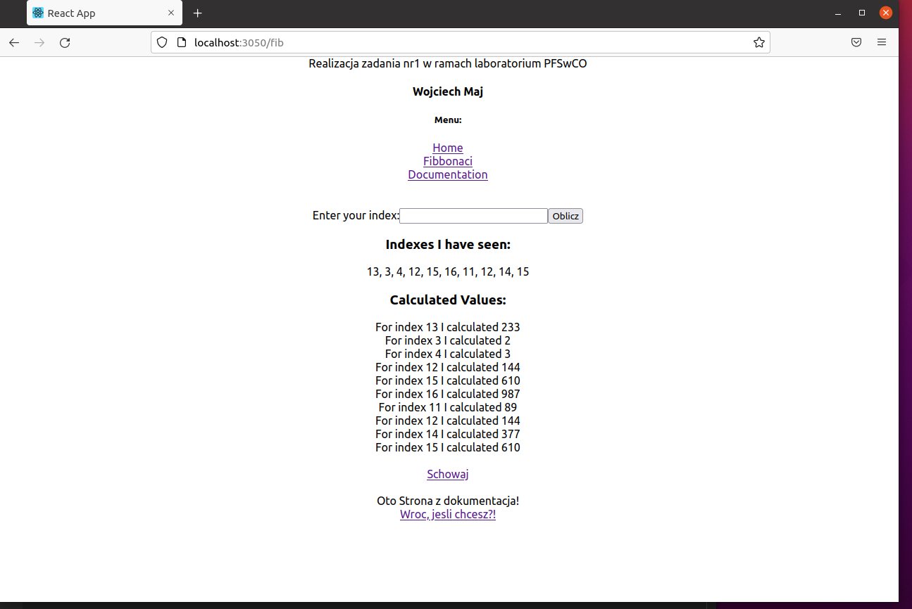

Oto Strona z dokumentacja!<br/>

      Dokonane zmiany w plikach, aby w pełni wykonać zadanie:
      - Zmiana funkcji liczącej fib worker/index.js na taką jaka mam w lab 8 <br/>
      - zmianiłem plik App.js tak by był zgodny z poleceniami w zad1.pdf <br/>
      - zmieniłem plik Fib.js tak bay by zgodny z poleceniami w zad1.pdf <br/>
      - zmieniłem plik server/index.js aby powyżej 10 rekordów zwracał tylko ostatnie 10 <br/>
      - Niestey nie dodaem przycisku, ktory by wyswietlal ostanie obliczenia, bo cos mi nie zwraca wartosci i nie wiem czemu xd 
      - ale po dodaniu nowej wartosci do obliczenia odswieza strone 
      


Oczywiscie aby uruchomic usluge wystarczy komenda:

```cmd
DOCKER_BUILDKIT=1 docker compose -f docker-compose.dev.yml up --build
```

